# Bloodlines & Classes

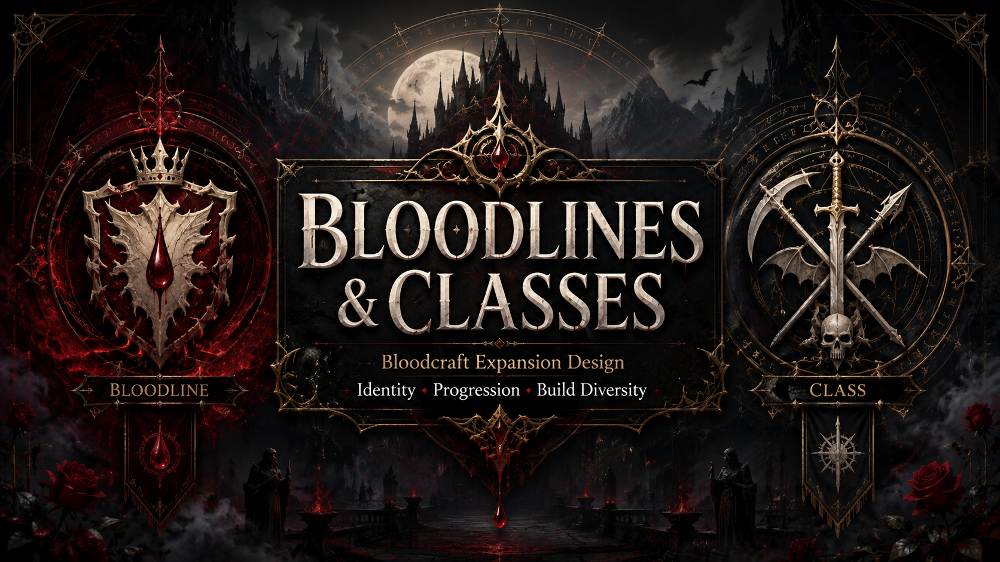

> **Status:** Expansion design proposal. This page defines target gameplay and content; it does **not** claim these systems are currently implemented.
>
> **Goal:** Add persistent character identity and new combat archetypes on top of Bloodcraft without replacing Bloodcraft's progression systems.

## Overview

The expansion separates character identity into four layers:


1. **Bloodline** — what the vampire *is*. Permanent strengths, weaknesses, feeding interactions, racial abilities and lineage progression.
2. **Class** — how the vampire *fights*. A resource loop, combat rhythm, signature mechanic and role.
3. **Specialization** — how the class evolves at endgame. Specializations change the class loop rather than merely adding flat statistics.
4. **Bloodcraft progression** — weapon expertise, blood legacy, professions, prestige and other existing progression remain meaningful underneath the new systems.

The design deliberately avoids hard race/class locks. A bloodline may synergize with a class, but players should be able to build unusual combinations without being punished into a single meta choice.

---

# Bloodlines


Bloodlines are selected separately from class. They are intended to be persistent identity choices with both advantages and meaningful drawbacks.

## Pureblood

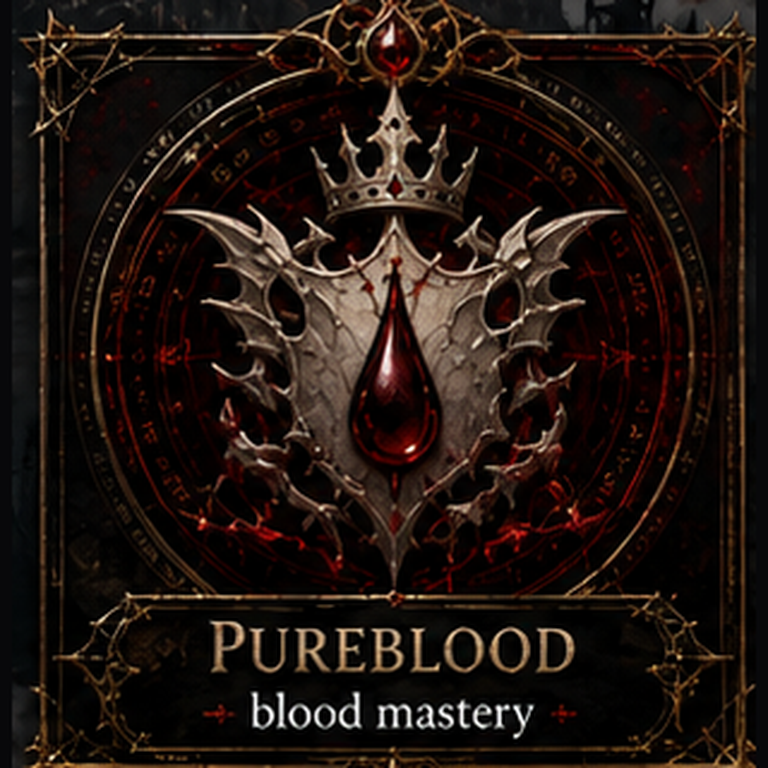

**Fantasy:** Ancient aristocratic vampire lineage focused on blood purity, control and efficiency.

**Core identity**
- Stronger interaction with high-quality blood.
- Improved blood efficiency and blood-stat scaling.
- Vulnerable to holy effects compared with less-pure lineages.

**Feeding trait — Refined Palate**
- Feeding on very high-quality blood grants a temporary bonus to the strongest stat supplied by that blood type.

**Racial ability — Noble Restraint**
- Temporarily slows blood drain and improves recovery from feeding.

**Weakness — Consecrated Blood**
- Increased holy damage received.

**Evolution paths**
- **Sanguine Regent:** doubles down on blood quality, sustain and party utility.
- **Crimson Sovereign:** converts purity into offensive blood magic.

---

## Nosferatu

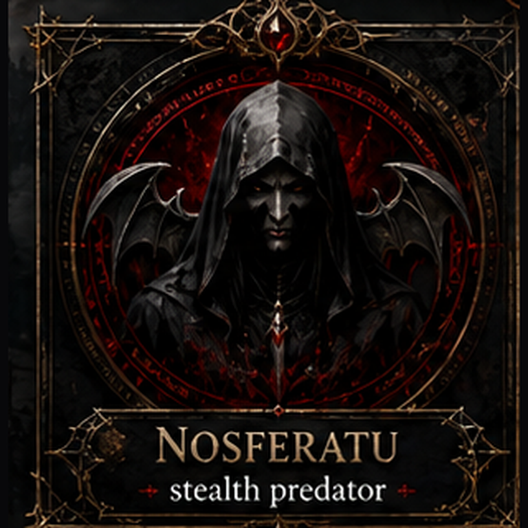

**Fantasy:** Twisted nocturnal predator built around stalking, ambushes and opportunistic feeding.

**Core identity**
- Improved movement and critical pressure at night.
- Reduced enemy awareness while outside combat.
- Reduced direct healing efficiency.

**Feeding trait — Predator's Instinct**
- Feeding on Rogue or Creature blood primes the next successful ambush for bonus damage.

**Racial ability — Shadowmeld**
- After remaining still outside combat, the vampire becomes heavily obscured until moving, attacking or taking damage.

**Weakness — Withered Flesh**
- Reduced healing received from direct restorative effects.

**Evolution paths**
- **Night Predator:** mobility, critical strikes and target execution.
- **Crypt Stalker:** stealth, debuffs and prolonged hunts.

---

## Draculian

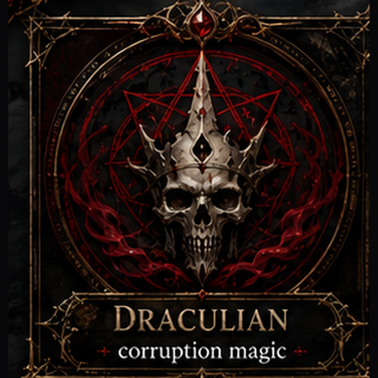

**Fantasy:** A lineage touched by Dracula's corruption and forbidden arcane power.

**Core identity**
- Increased spell pressure and corruption resistance.
- Better interaction with corrupted or draconic enemies.
- Blood depletes more quickly under sustained spellcasting.

**Feeding trait — Tainted Vintage**
- Mutant and corrupted blood sources have a chance to grant a short-lived spell amplification effect.

**Racial ability — Crimson Edict**
- Converts a portion of current blood into a short burst of spell power and cooldown recovery.

**Weakness — Voracious Sorcery**
- Heavy spell use temporarily increases blood drain.

**Evolution paths**
- **Draculian Arcanist:** ranged spellcasting and cooldown manipulation.
- **Draculian Warlord:** weapon/spell hybrid using corruption offensively.

---

## Bloodborn

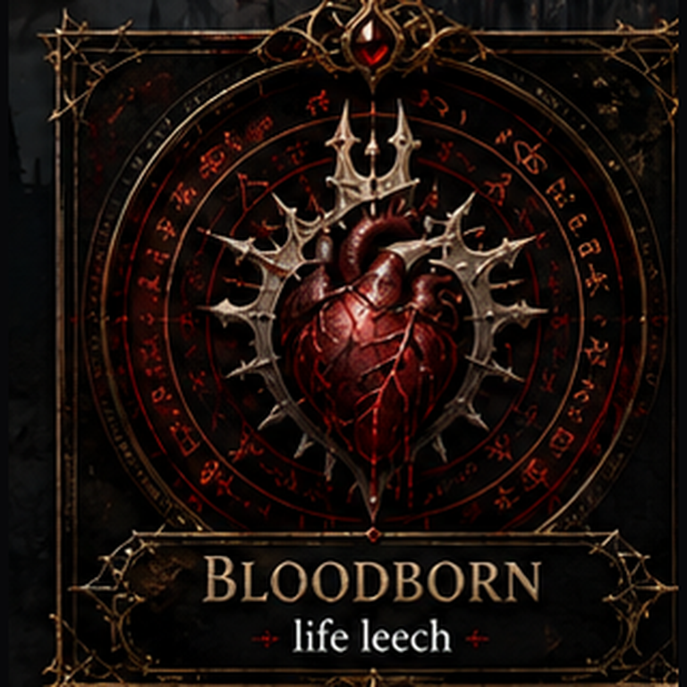

**Fantasy:** Vampires whose bodies are unusually attuned to feeding, lifesteal and blood manipulation.

**Core identity**
- Improved life leech and combat sustain.
- Feeding creates short combat buffs.
- Lower maximum health than heavier lineages.

**Feeding trait — Living Reservoir**
- Successful feeding stores a small temporary reserve that can be consumed by racial or class abilities.

**Racial ability — Hemorrhagic Renewal**
- Converts stored blood reserve into health over a short duration.

**Weakness — Thin Vessel**
- Reduced maximum health.

**Evolution paths**
- **Bloodfiend:** aggressive leeching, wounds and execution.
- **Red Alchemist:** blood conversion, recovery and utility.

---

## Dreadborn

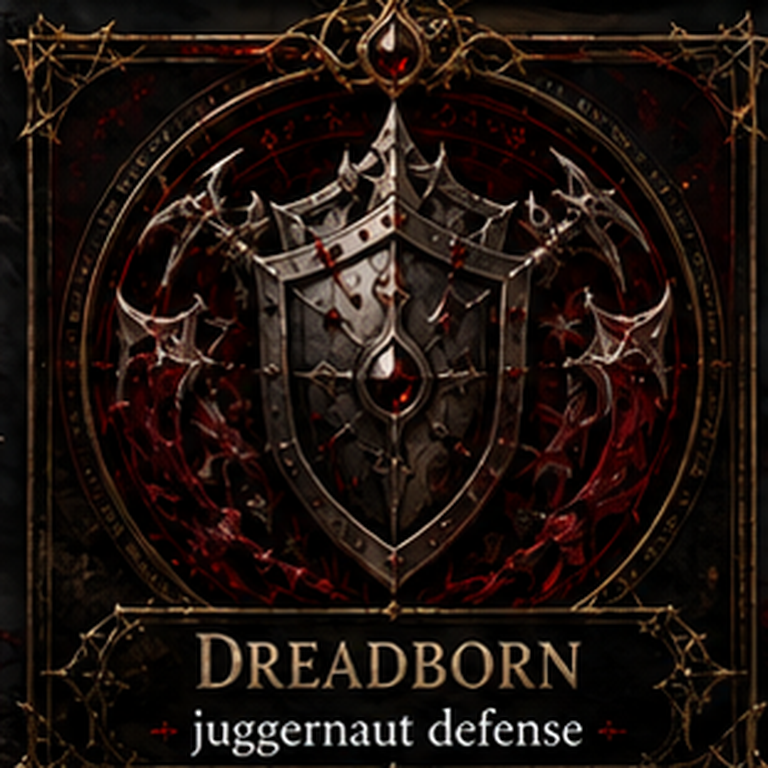

**Fantasy:** Massive, resilient vampires built to endure prolonged fights.

**Core identity**
- Increased maximum health and damage resistance.
- Better stagger/knockback resistance.
- Reduced movement speed.

**Feeding trait — Iron Stomach**
- Warrior and Brute blood grant a brief defensive buffer after feeding.

**Racial ability — Unyielding**
- Temporarily gains crowd-control resistance and damage reduction.

**Weakness — Heavy Frame**
- Reduced movement speed and slower disengagement.

**Evolution paths**
- **Dread Tyrant:** offensive bruiser and intimidation.
- **Stoneblood:** maximum survivability and frontline control.

---

## Nightstalker

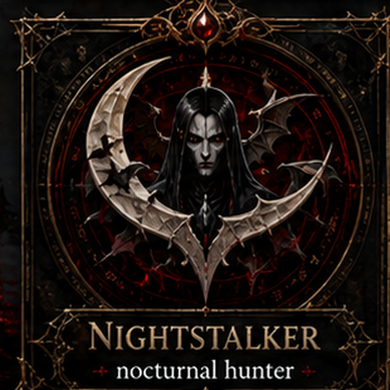

**Fantasy:** Hunters that peak under darkness and specialize in tracking wounded prey.

**Core identity**
- Stronger nighttime combat performance.
- Improved pursuit against low-health enemies.
- Reduced daytime combat bonuses.

**Feeding trait — Scent of Weakness**
- Feeding marks the surrounding area briefly, highlighting nearby injured hostile targets.

**Racial ability — Moonrush**
- A short directional burst that becomes stronger at night.

**Weakness — Daybound**
- Several racial bonuses are suppressed during daytime.

**Evolution paths**
- **Moon Hunter:** pursuit, movement and critical strikes.
- **Pale Tracker:** scouting, marks and group target focus.

---

## Voidtouched

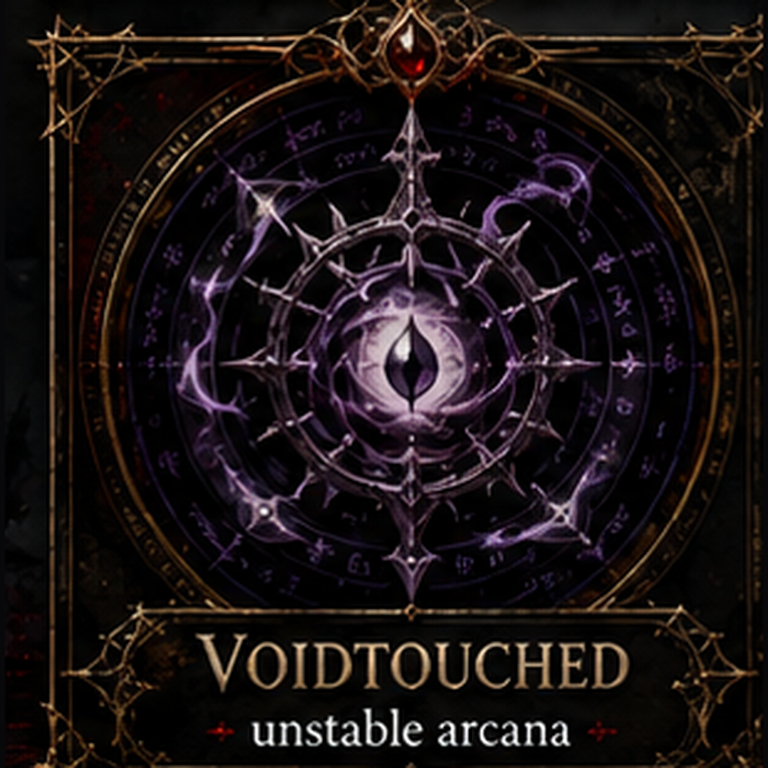

**Fantasy:** Vampires destabilized by void energies, trading consistency for powerful spell manipulation.

**Core identity**
- Improved cooldown recovery and spell utility.
- Chance-based arcane effects.
- Reduced physical resilience.

**Feeding trait — Unstable Assimilation**
- Feeding has a small chance to duplicate or distort a temporary blood-derived effect.

**Racial ability — Slip Between**
- Briefly phases the vampire, granting movement freedom and a short defensive window.

**Weakness — Fractured Form**
- Reduced physical resistance.

**Evolution paths**
- **Riftborn:** mobility, displacement and cooldown manipulation.
- **Nullblood:** anti-magic, disruption and spell defense.

---

## Graveborn

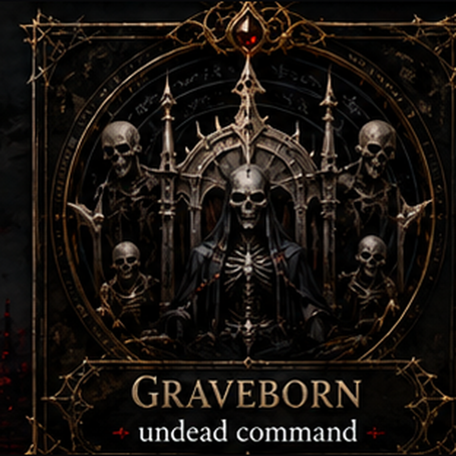

**Fantasy:** Death-attuned vampires with unusual affinity for undead, condemned enemies and summoned creatures.

**Core identity**
- Improved summon duration and unholy interactions.
- Gains secondary value from killing undead rather than feeding on them.
- Increased fire and holy vulnerability.

**Feeding trait — Ossuary Memory**
- Destroying undead builds Grave Essence; feeding consumes part of it to grant a temporary minion or unholy bonus.

**Racial ability — Call of the Crypt**
- Releases stored Grave Essence to empower allied summons or create a short defensive undead ward.

**Weakness — Funeral Pyre**
- Increased fire and holy damage received.

**Evolution paths**
- **Grave Patriarch:** summon leadership and persistent minion bonuses.
- **Ashen Revenant:** self-sustain, curses and death-triggered effects.

---

# Custom Classes


A class must introduce a **gameplay loop**, not simply a collection of percentage bonuses. Each class below has a dedicated resource or state that should be visible to the player through chat/UI feedback where practical.

## Reaper

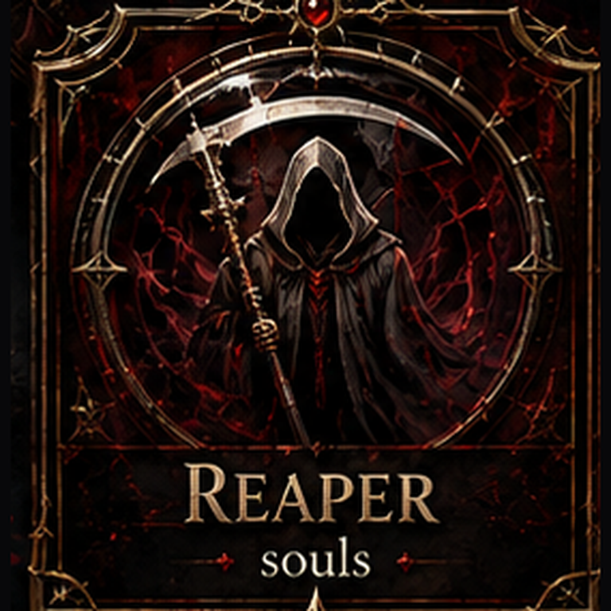

**Role:** Execution / melee pressure<br>
**Primary resource:** Souls

**Loop**
1. Apply Condemn or another qualifying death mark.
2. Kill marked targets to collect Souls.
3. Spend Souls to empower finishers, mobility or temporary summons.
4. Executions return part of the resource and keep the loop moving.

**Signature mechanic — Harvest**
- Marked enemy deaths generate Souls.
- Elite and boss targets generate more.

**Specializations**
- **Harvester:** execute low-health enemies and chain Soul refunds.
- **Soulbinder:** spend Souls on spectral assistance and control.
- **Doomsayer:** turns Soul spending into curses and area pressure.

---

## Blood Reaver

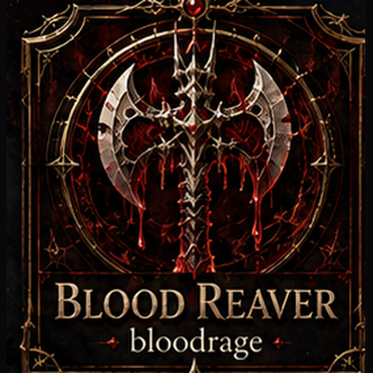

**Role:** Berserker / sustained melee<br>
**Primary resource:** Bloodrage

**Loop**
- Dealing and receiving damage builds Bloodrage.
- Higher Bloodrage increases offensive pressure but reduces defensive stability.
- Reaching maximum rage enables a short Frenzy state.
- Skilled players decide whether to cash out rage safely or ride the dangerous maximum.

**Signature mechanic — Frenzy**
- Attack speed and life leech increase temporarily at peak Bloodrage.

**Specializations**
- **Butcher:** weapon damage and execution.
- **Ravager:** maximum Frenzy uptime.
- **Red Juggernaut:** converts rage into defensive sustain.

---

## Frost Warden

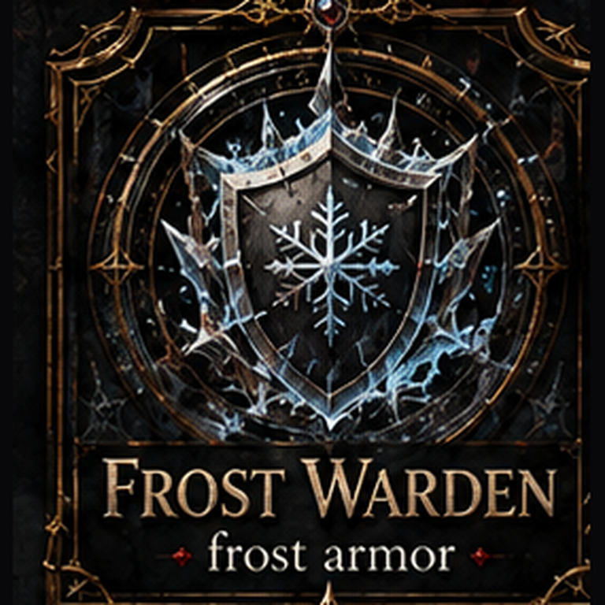

**Role:** Tank / control<br>
**Primary resource:** Frost Armor

**Loop**
- Blocking, shielding or taking controlled hits builds Frost Armor.
- At threshold, the next qualifying ability consumes the armor to Chill or Freeze nearby enemies.
- Defensive play becomes an offensive control tool.

**Signature mechanic — Shatterguard**
- Consuming full Frost Armor creates an area burst and briefly improves resistance.

**Specializations**
- **Glacier:** maximum defense and shielding.
- **Winterblade:** melee shatter combos.
- **White Sentinel:** party protection and control.

---

## Plague Doctor

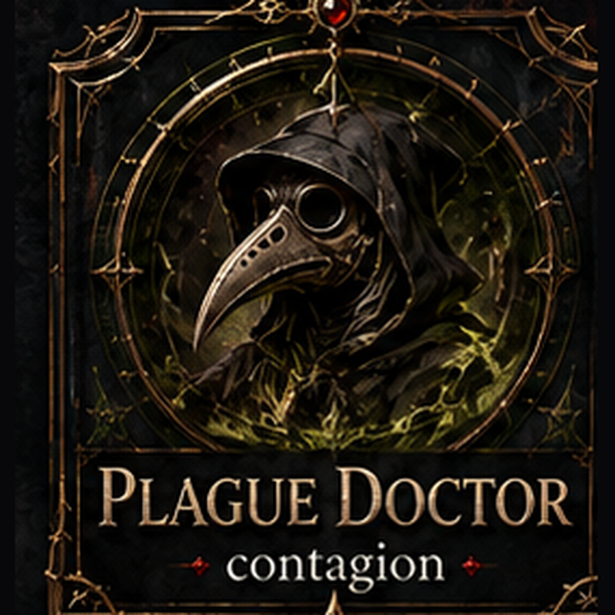

**Role:** Damage-over-time / debuff support<br>
**Primary resource:** Contagion

**Loop**
- Apply poison, disease or qualifying debuffs.
- Each affected enemy increases Contagion.
- Spend Contagion to spread effects, detonate them or create a plague zone.

**Signature mechanic — Outbreak**
- A target with enough stacked disease spreads a weaker copy to nearby enemies.

**Specializations**
- **Pestilent:** maximum damage-over-time pressure.
- **Chirurgeon:** debuffs and ally utility.
- **Mutagenist:** unstable buffs and enemy mutation effects.

---

## Beastmaster

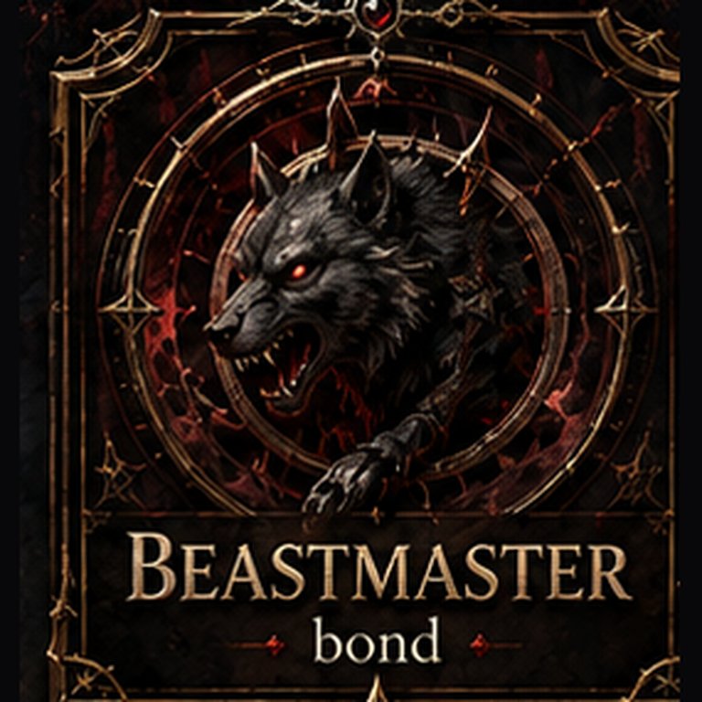

**Role:** Familiar / companion hybrid<br>
**Primary resource:** Bond

**Loop**
- Fight near an active familiar to build Bond.
- Commands and coordinated attacks consume Bond.
- Familiar category changes portions of the class kit.

**Category examples**
- **Beast:** physical pressure and pursuit.
- **Undead:** summons and unholy effects.
- **Demon:** spell pressure and aggression.
- **Human:** utility and control.
- **Mechanical:** defense and ranged support.

**Specializations**
- **Packlord:** direct familiar damage.
- **Warden:** protection and shared defenses.
- **Alpha Predator:** vampire/familiar coordinated melee.

---

## Spellblade

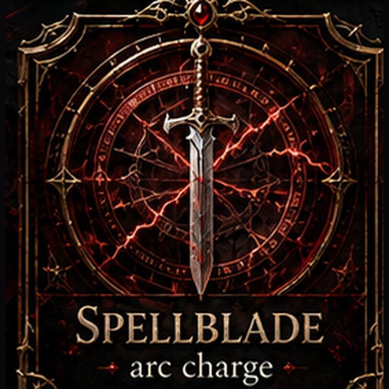

**Role:** Weapon/spell hybrid<br>
**Primary resource:** Arc Charge

**Loop**
- Weapon attacks generate Spell Charge.
- Spell casts generate Blade Charge.
- Alternating attack types grants Arc Charge.
- Repeating only one side of the kit is intentionally less efficient.

**Signature mechanic — Arc Weave**
- At maximum Arc Charge, the next weapon or spell action gains a mirrored secondary effect.

**Specializations**
- **Runeblade:** weapon-first hybrid.
- **Battlemage:** spell-first hybrid.
- **Arc Dancer:** movement and rapid alternation.

---

## Soulbinder

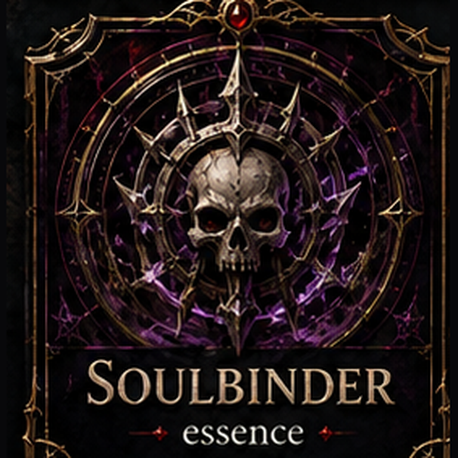

**Role:** Summoner / battlefield control<br>
**Primary resource:** Essence

**Loop**
- Enemy deaths and qualifying unholy effects generate Essence.
- Spend Essence on temporary undead, empowerment or sacrificial effects.
- Summons are tactical and temporary rather than permanent passive damage.

**Signature mechanic — Bind**
- A portion of defeated enemies can leave bindable Essence based on enemy tier.

**Specializations**
- **Bonecaller:** numerous short-lived minions.
- **Lich:** fewer summons, stronger spellcasting.
- **Grave Marshal:** empowers a small elite retinue.

---

## Blood Priest

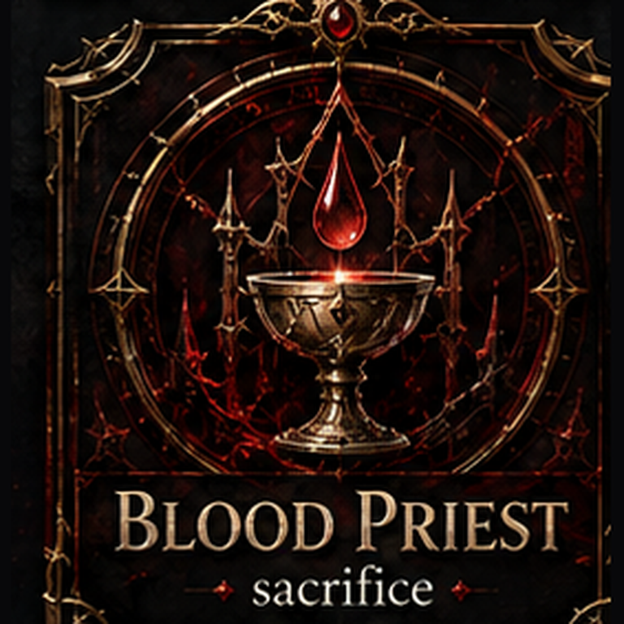

**Role:** Support / sustain<br>
**Primary resource:** Sacrifice

**Loop**
- Healing, shielding or transferring health builds Sacrifice.
- Spend Sacrifice to cleanse, empower allies or create blood wards.
- The class trades personal safety for group stability.

**Signature mechanic — Blood Tithe**
- Convert a controlled amount of current health or blood into an ally-facing effect.

**Specializations**
- **Sanguine Saint:** healing and recovery.
- **Crimson Oracle:** buffs, marks and prediction-style utility.
- **Martyr:** defensive sacrifice and emergency saves.

---

## Dread Knight

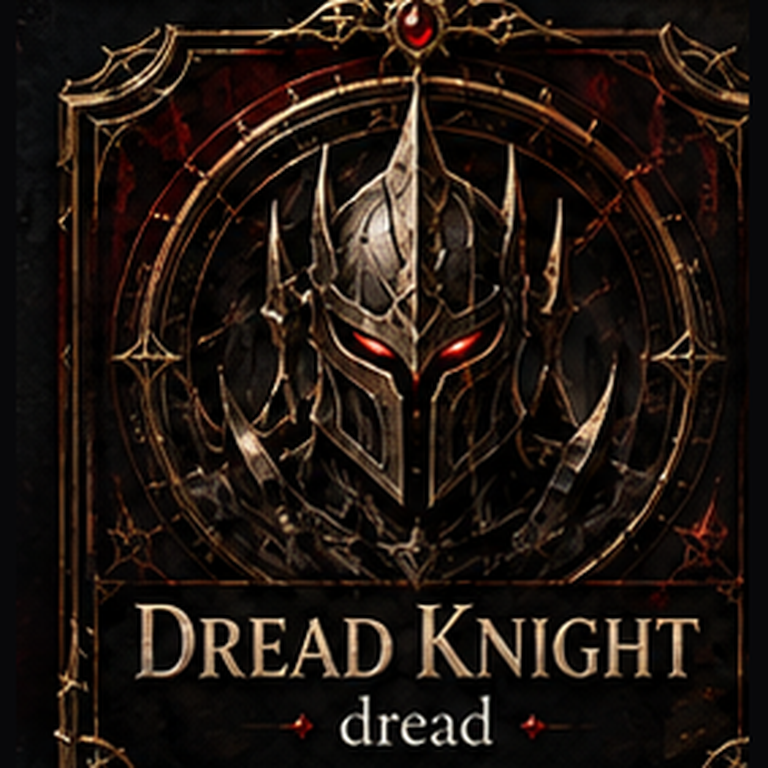

**Role:** Bruiser / intimidation tank<br>
**Primary resource:** Dread

**Loop**
- Remaining close to dangerous enemies builds Dread.
- Taking control of the front line increases generation.
- Spend Dread on fear-like disruption, armor or punishing counterattacks.

**Signature mechanic — Dominion**
- Elite enemies and bosses generate more Dread, encouraging frontline commitment.

**Specializations**
- **Blackguard:** armor and counterattacks.
- **Tyrant:** intimidation and area control.
- **Doom Knight:** offensive dark magic bruiser.

---

## Riftwalker

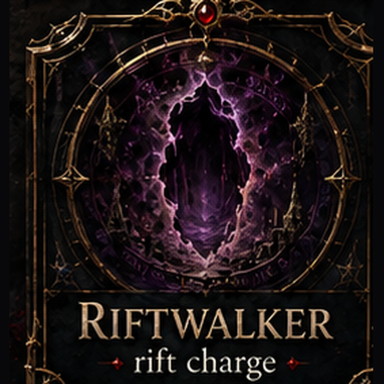

**Role:** Mobility / positional spell damage<br>
**Primary resource:** Rift Charge

**Loop**
- Dashes, teleports and rapid position changes build Rift Charge.
- Spend charge to leave damaging rifts, repeat a movement skill or empower a spell from a new angle.
- Remaining stationary causes charge to decay.

**Signature mechanic — Afterimage**
- High-charge movement leaves a temporary echo that repeats a reduced effect.

**Specializations**
- **Phaseblade:** close-range teleport combos.
- **Voidrunner:** extreme mobility and cooldown play.
- **Rift Savant:** ranged spell geometry and area denial.

---

# Bloodline × Class Philosophy

Bloodlines and classes should use **soft synergies**, not mandatory pairings.

Examples:

| Combination | Result |
|---|---|
| Nosferatu + Reaper | Ambush-oriented execution build |
| Dreadborn + Reaper | Durable melee harvester |
| Graveborn + Soulbinder | Strong summon/undead identity |
| Bloodborn + Blood Priest | High-risk sustain/support |
| Voidtouched + Spellblade | Cooldown-heavy hybrid |
| Nightstalker + Riftwalker | Extreme pursuit and repositioning |

A synergy may grant a small thematic modifier, altered resource behavior or unique cosmetic title. It should **not** be so powerful that every Reaper must choose the same bloodline.

---

# Progression

## Bloodline progression

Suggested milestones:

- **Rank I — Awakened:** base passive + weakness.
- **Rank II — Mature:** feeding trait.
- **Rank III — Ancient:** racial ability.
- **Rank IV — Exalted:** choose an evolution path.

Possible progression sources:
- feeding milestones,
- V Blood kills,
- Bloodcraft level/prestige thresholds,
- blood-quality achievements,
- race-specific challenges.

## Class progression

Suggested milestones:

- **Initiate:** resource system unlocked.
- **Adept:** signature mechanic.
- **Master:** class modifier slot.
- **Ascendant:** specialization choice.

Class progression should reward using the class's intended loop rather than generic kill XP wherever technically practical.

---

# Respecialization

Server owners should be able to configure:

- whether bloodlines can be changed,
- whether class changes are free or cost currency/items,
- cooldown between respecs,
- prestige requirements,
- whether specialization changes require a ritual or boss kill,
- whether PvP servers lock choices during siege windows.

Default design preference: **classes are reasonably respec-friendly; bloodlines are more consequential but never permanently account-bricking.**

---

# Configuration Direction

The system should be data-driven wherever possible.

```text
BloodcraftExpansion/
├── config/
│   ├── bloodlines/
│   ├── classes/
│   └── specializations/
├── docs/
│   ├── BLOODLINES_AND_CLASSES.md
│   └── assets/
└── src/
    ├── Bloodlines/
    ├── Classes/
    ├── Progression/
    └── Integration/
```

Conceptual bloodline definition:

```json
{
  "id": "nosferatu",
  "displayName": "Nosferatu",
  "passives": ["night_movement", "reduced_detection"],
  "weaknesses": ["reduced_direct_healing"],
  "feedingTrait": "predators_instinct",
  "racialAbility": "shadowmeld",
  "evolutions": ["night_predator", "crypt_stalker"]
}
```

Conceptual class definition:

```json
{
  "id": "reaper",
  "displayName": "Reaper",
  "role": "execution",
  "resource": "souls",
  "resourceSources": ["marked_kill", "elite_kill"],
  "signatureMechanic": "harvest",
  "specializations": ["harvester", "soulbinder", "doomsayer"]
}
```

These are **design examples**, not a commitment to a specific serialization library or runtime schema.

---

# Server Administration Requirements

A production implementation should provide:

- global enable/disable switches,
- per-bloodline and per-class toggles,
- configurable passive values,
- configurable progression requirements,
- configurable respec rules,
- admin force-set/reset commands,
- safe migration when a bloodline/class is disabled,
- verbose debug logging for resource generation and progression,
- persistence keyed to the same stable player identity strategy used elsewhere in the server mod stack.

---

# Balance Rules

1. **Identity over raw power.** Prefer new decisions and loops over universal damage bonuses.
2. **Every strength needs a cost.** Bloodlines should include a meaningful drawback or opportunity cost.
3. **No mandatory pairing.** Synergies must stay small enough that unusual combinations remain viable.
4. **PvE and PvP values must be independently configurable** when an effect materially impacts combat.
5. **Bosses should not trivialize class resources.** Resource generation from bosses needs caps or normalized formulas.
6. **Server owners control complexity.** Any bloodline, class or specialization can be disabled individually.
7. **Fail safely.** Missing/invalid content definitions should disable that content entry rather than destabilize the server.

---

# Implementation Phases

## Phase 1 — Framework
- Persistence model.
- Bloodline selection.
- Class selection.
- Admin/player commands.
- Config loading and validation.
- Resource-state abstraction.
- Bloodcraft integration boundary.

## Phase 2 — First playable content
Recommended initial vertical slice:
- Bloodlines: Pureblood, Nosferatu, Dreadborn, Graveborn.
- Classes: Reaper, Frost Warden, Spellblade, Beastmaster.
- One specialization per initial class.
- Respec flow.
- Debug/admin tooling.

## Phase 3 — Full roster
- All eight bloodlines.
- All ten classes.
- Three specializations per class.
- Soft bloodline/class synergies.
- Expanded racial progression.

## Phase 4 — Content integration
- World bosses and events rewarding bloodline/class progression.
- Relics that modify class resources.
- Race-specific bounties/challenges.
- Prestige hooks.
- Optional Discord/SanguineRelay announcements for rare progression events.

---

# Open Technical Questions

The implementation should validate these against the current V Rising/Bloodcraft environment before locking architecture:

- Which Bloodcraft APIs/services are safe to reference directly versus requiring optional reflection/integration adapters?
- Which existing buffs can represent racial passives without creating client desync?
- Which ability slots can be modified safely while remaining compatible with other popular ability mods?
- What server-authoritative UI feedback is practical without requiring every client to install a custom UI mod?
- How should active resource state survive reconnects, deaths and server restarts?
- What is the cleanest migration strategy if content IDs are renamed?

These questions are intentionally left open for implementation research rather than guessed in the design documentation.

---

# Definition of Done for the Feature Family

The Bloodlines & Classes expansion is considered production-ready when:

- player choices persist across restarts;
- disabled/removed definitions migrate safely;
- every resource mechanic is server-authoritative;
- all gameplay numbers are configurable;
- PvP-impacting values can be tuned independently where necessary;
- admins can inspect and reset a player's state;
- each shipped class has a distinct loop verified in playtesting;
- no class or bloodline requires a specific pairing to remain viable;
- documentation matches actual commands/configuration;
- compatibility failures degrade gracefully rather than crash the server.
