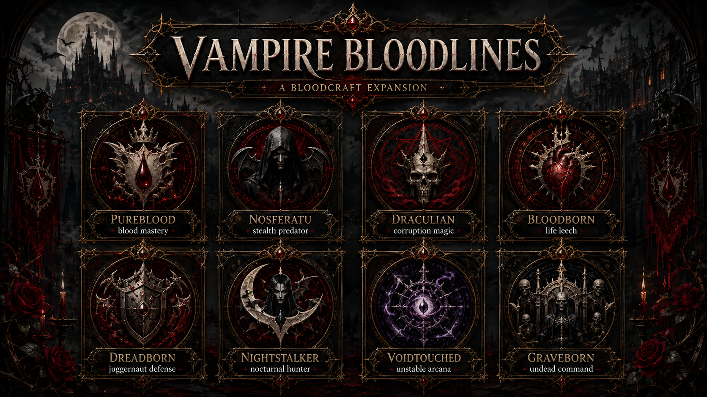

# Vampire Bloodlines

!!! expansion "BloodcraftExpansion Content"
    This page describes custom content designed for this project and is not part of upstream Bloodcraft unless explicitly stated otherwise.

The proposal defines eight persistent vampire identities layered above Bloodcraft's upstream blood-legacy system.

| Bloodline | Design identity |
|---|---|
| Pureblood | Aristocratic control, blood efficiency, and refined power |
| Nosferatu | Stealth, ambush, and predatory survival |
| Draculian | Martial authority and ancient vampire dominance |
| Bloodborn | Aggressive blood combat and sustain |
| Dreadborn | Fear, pressure, and battlefield disruption |
| Nightstalker | Mobility, hunting, and darkness |
| Voidtouched | Arcane distortion and high-risk power |
| Graveborn | Death magic, attrition, and undead affinity |

These are planned custom identities—not the upstream Worker, Warrior, Scholar, Rogue, Mutant, Draculin, Immortal, Creature, Brute, and Corruption legacy types. The detailed traits, progression, and artwork remain in [Bloodlines & Classes](BLOODLINES-AND-CLASSES.md).

---

[Wiki Home](../HOME.md) · [Commands](../reference/COMMANDS.md) · [Configuration](../reference/CONFIGURATION.md)
