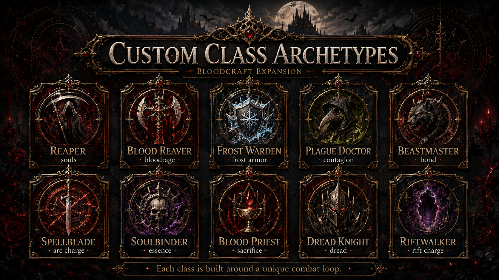

# Custom Classes

!!! expansion "BloodcraftExpansion Content"
    This page describes custom content designed for this project and is not part of upstream Bloodcraft unless explicitly stated otherwise.

The expansion proposal contains ten classes:

| Class | Proposed fantasy |
|---|---|
| Reaper | Mobile executioner |
| Blood Reaver | Blood-fueled frontline aggression |
| Frost Warden | Defensive frost control |
| Plague Doctor | Decay, contagion, and support |
| Beastmaster | Companion-focused combat |
| Spellblade | Weapon-and-spell hybrid |
| Soulbinder | Spirit control and binding |
| Blood Priest | Sacrificial support |
| Dread Knight | Armored fear and attrition |
| Riftwalker | Spatial and void manipulation |

These are not Bloodcraft's six upstream classes. See [Official Classes](../classes/README.md) for Blood Knight, Demon Hunter, Vampire Lord, Shadow Blade, Arcane Sorcerer, and Death Mage.

Full mechanics and artwork are preserved in [Bloodlines & Classes](BLOODLINES-AND-CLASSES.md).

---

[Wiki Home](../HOME.md) · [Commands](../reference/COMMANDS.md) · [Configuration](../reference/CONFIGURATION.md)
