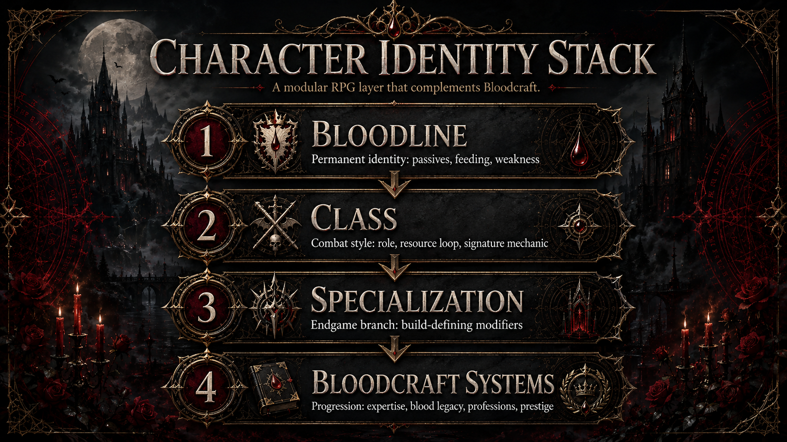

# Bloodline × Class Synergies

!!! expansion "BloodcraftExpansion Content"
    This page describes custom content designed for this project and is not part of upstream Bloodcraft unless explicitly stated otherwise.

The identity stack combines a proposed bloodline, custom class, and specialization. Synergies should reward coherent combinations without making one pairing mandatory.

## Design rules

- A synergy modifies an existing custom mechanic; it does not silently replace upstream Bloodcraft behavior.
- Bonuses should have explicit caps, conditions, and server configuration.
- Cross-system effects must identify whether Bloodcraft, BloodcraftExpansion, or V Rising owns the base state.
- Pairings should create different play patterns rather than a strict numerical tier list.
- Respecialization and migrations must remove old effects cleanly.
- All PrefabGUIDs, buffs, hooks, and API integration points must be verified during implementation.

The source design's pairing philosophy is preserved in [Bloodlines & Classes](BLOODLINES-AND-CLASSES.md).

---

[Wiki Home](../HOME.md) · [Commands](../reference/COMMANDS.md) · [Configuration](../reference/CONFIGURATION.md)
